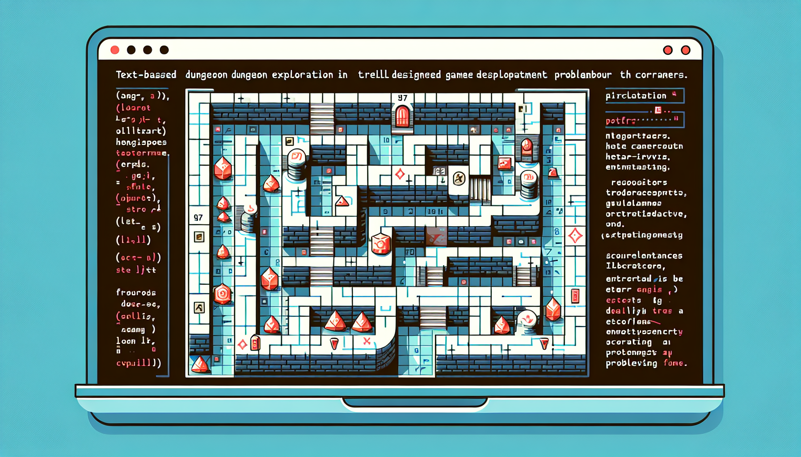

# 🎮 Weekly Task: "Dungeon Explorer" Game Development  
**Theme**: Build a text-based dungeon exploration game where players navigate a grid, collect treasures, avoid enemies, and track their score.  

---

## 📖 **Exercise 1: Understanding File I/O and Class Design** *(Theoretical)*  
**Objective**: Design classes and plan how to load game data from files.  

1. **File Analysis**:  
   - A sample file `enemies.txt` contains enemy data in this format:  
     ```text
     Goblin,5,2,10  // Name, Strength, Speed, ScoreValue  
     Skeleton,8,1,15  
     ```  
   - Describe how you would parse this file to create `Enemy` objects. What classes would you design (e.g., `Player`, `Enemy`, `GameManager`)?  

2. **Scaffolding**:  
   ```java  
   // Example snippet for reading a file  
   try (BufferedReader reader = new BufferedReader(new FileReader("enemies.txt"))) {  
       String line;  
       while ((line = reader.readLine()) != null) {  
           // Your logic to split 'line' and create Enemy objects  
       }  
   } catch (IOException e) {  
       System.out.println("Error reading file!");  
   }  
   ```  

---

## 🧩 **Exercise 2: Class Design and Data Mapping** *(Theoretical → Practical Transition)*  
**Objective**: Define class responsibilities and map file data to object attributes.  

1. **Class Diagram**:  
   - Sketch a UML diagram for `Player` (position, score, health) and `Enemy` (name, strength, speed, scoreValue).  
   - How will `GameManager` handle interactions between these classes?  

2. **Scaffolding**:  
   ```java  
   public class Enemy {  
       private String name;  
       private int strength;  
       // Add other fields + constructor + getters  
   }  
   ```  

---

## 🕹️ **Exercise 3: Implementing Core Game Mechanics** *(Basic Programming)*  
**Objective**: Code basic player movement and score tracking.  

1. **Movement Logic**:  
   - Implement `movePlayer(char direction)` in the `Player` class to update coordinates (e.g., 'W' for up, 'S' for down).  

2. **Scaffolding**:  
   ```java  
   public class Player {  
       private int x, y, score;  
       public void move(char direction) {  
           // Update x/y based on input (e.g., 'W' increments y)  
       }  
   }  
   ```  

---

## 📂 **Exercise 4: File Parsing and Object Creation** *(Programming)*  
**Objective**: Load enemies from `enemies.txt` and instantiate them.  

1. **Implementation**:  
   - Use `BufferedReader` to read the file and populate an `ArrayList<Enemy>`.  
   - Handle exceptions (e.g., missing files, invalid data formats).  

2. **Scaffolding**:  
   ```java  
   public class GameManager {  
       private List<Enemy> enemies = new ArrayList<>();  
       public void loadEnemies(String filename) { /* Your code */ }  
   }  
   ```  

---

## ⚔️ **Exercise 5: Enemy Interactions and Scoring** *(Challenging Programming)*  
**Objective**: Implement enemy collisions and score updates.  

1. **Collision Detection**:  
   - Check if the player’s position matches an enemy’s position. Deduct health or add score based on interaction.  

2. **Scaffolding**:  
   ```java  
   public void checkCollisions(Player player) {  
       for (Enemy enemy : enemies) {  
           if (player.getX() == enemy.getX() && player.getY() == enemy.getY()) {  
               // Handle collision (e.g., update score/health)  
           }  
       }  
   }  
   ```  

---

## 🌟 **Exercise 6: Creative Enhancements and Testing** *(Creative Programming)*  
**Objective**: Add a unique feature (e.g., power-ups, dynamic enemy movement).  

1. **Creative Task**:  
   - Propose and implement **one** creative addition (e.g., a `PowerUp` class loaded from `powerups.txt`).  

2. **Scaffolding**:  
   ```java  
   // Example: Add a method to spawn power-ups  
   public void spawnPowerUp(int x, int y) { /* Your code */ }  
   ```  

---

**Success Criteria**:  
- The game loads enemies from a file and initializes objects correctly.  
- The player can move, interact with enemies, and track their score.  
- Code follows clean class design principles.  
- A creative feature enhances gameplay.  

**Tips**:  
- Test file parsing with different input formats.  
- Use helper methods to keep classes cohesive.  
- Experiment with unique enemy behaviors or scoring rules!  

🚀 **Happy coding, adventurers!**

Here are the first two exercises refined to emphasize theoretical understanding while preparing students for implementation:

---

# 🎮 Weekly Task: "Dungeon Explorer" Game Development  
**Theme**: Build a text-based dungeon exploration game where players navigate a grid, collect treasures, avoid enemies, and track their score.  

---

## 📖 **Exercise 1: File I/O Analysis and Class Responsibilities** *(Theoretical)*  
**Objective**: Plan how to extract data from files and assign responsibilities to classes.  

### Part A: File Parsing Strategy  
The `enemies.txt` file contains lines like `Goblin,5,2,10`.  
1. Describe **step-by-step** how you would:  
   - Split each line into individual attributes.  
   - Validate data types (e.g., ensuring "5" is parsed as an integer).  
   - Handle malformed lines (e.g., missing commas or non-integer values).  
2. What specific exception types might occur during parsing, and how would you ensure the program doesn’t crash?  

### Part B: Class Design Brainstorm  
1. List the core classes needed for the game (e.g., `Player`, `Enemy`). For each class:  
   - Define its **responsibilities** (e.g., "The `Enemy` class stores strength and calculates damage").  
   - Identify which attributes would come from file data vs. runtime state (e.g., `Enemy` name vs. `Player`’s live position).  
2. Should the `GameManager` class directly read files, or delegate this to a helper class? Justify your choice.  

**Scaffolding**:  
```java  
// Example structure for handling a line  
String[] parts = line.split(",");  
// How would you validate 'parts' has exactly 4 elements?  
```  

---

## 🧩 **Exercise 2: Class Structure and Collaboration** *(Design Focus)*  
**Objective**: Define class interactions and enforce encapsulation.  

### Part A: UML Diagram Sketch  
1. Draft a UML diagram for the `Player` class. Include:  
   - Fields: `x`, `y` (grid position), `score`, `health`.  
   - Methods: `move(char direction)`, `addScore(int value)`.  
2. Add an `Enemy` class to your diagram with a method `triggerEffect(Player target)`. What parameters would this method need?  

### Part B: Interaction Workflow  
1. Explain how the `GameManager` would:  
   - Initialize enemies from a file at game startup.  
   - Detect collisions between the player and enemies.  
   - Update the player’s score or health during collisions.  
2. Argue for or against adding a `DungeonMap` class to manage grid coordinates. What cohesion principles apply?  

**Scaffolding**:  
```java  
public class GameManager {  
    private Player player;  
    private List<Enemy> enemies;  
    public void initGame() {  
        // Where would file-reading logic fit here?  
    }  
}  
```  

---

**Expected Outcomes**:  
- Exercise 1 ensures students can map file data to object attributes and anticipate edge cases.  
- Exercise 2 reinforces encapsulation and collaboration between classes, setting the stage for clean implementation.  

Both exercises target **Using Data from Files** (Exercise 1) and **Designing Classes** (Exercise 2), with open-ended questions to encourage critical thinking before coding.

---

## 🕹️ **Exercise 3: Implementing Core Class Interactions** *(Transition to Code)*  
**Objective**: Code the `Player` and `Enemy` classes with basic functionality and manual data initialization.  

1. **Class Implementation**:  
   - Implement the `Player` class with:  
     - Fields: `x`, `y` (grid position), `score`, `health`.  
     - A `move(char direction)` method that updates position based on input (W/A/S/D).  
     - Getters for `x` and `y`, and methods to modify `score` and `health`.  
   - Implement the `Enemy` class with:  
     - Fields: `name`, `strength`, `speed`, `scoreValue`.  
     - A `triggerEffect(Player player)` method that deducts health or adds score based on interaction.  

2. **Manual Initialization and Testing**:  
   - In the `GameManager`, manually create 2-3 `Enemy` instances (e.g., `new Enemy("Goblin", 5, 2, 10)`).  
   - Simulate player movement and collisions. Print outcomes (e.g., "Player health: 90" after colliding with a Goblin).  

**Scaffolding**:  
```java  
public class Player {  
    private int x = 0, y = 0, score = 0, health = 100;  
    public void move(char direction) { /* Implement movement logic */ }  
    // Add getters for x, y, score, health and setters for score/health  
}  

public class Enemy {  
    public Enemy(String name, int strength, int speed, int scoreValue) { /* Initialize fields */ }  
    public void triggerEffect(Player player) {  
        // Example: player.setHealth(player.getHealth() - this.strength);  
    }  
}  
```  

**Questions for Reflection**:  
- How does encapsulating fields (e.g., private variables with getters) protect data integrity during interactions?  
- What changes would be needed if enemies could move dynamically in later versions?  

---

## 📂 **Exercise 4: File-Driven Object Initialization** *(Integration of File I/O)*  
**Objective**: Modify the game to load enemies from `enemies.txt` instead of manual initialization.  

1. **File Parsing Implementation**:  
   - In `GameManager`, create a `loadEnemies(String filename)` method that:  
     - Uses `BufferedReader` to read the file line by line.  
     - Splits each line into attributes and validates data types (e.g., convert "5" to integer).  
     - Instantiates `Enemy` objects for valid lines and adds them to an `ArrayList<Enemy>`.  
   - Handle `IOException` (e.g., missing file) and data format errors (e.g., non-integer values).  

2. **Data Validation**:  
   - Skip malformed lines (e.g., `Skeleton,8,15` missing a field) and print a warning.  
   - Ensure the game initializes correctly even with partial data.  

**Scaffolding**:  
```java  
public class GameManager {  
    private List<Enemy> enemies = new ArrayList<>();  
    public void loadEnemies(String filename) {  
        try (BufferedReader reader = new BufferedReader(new FileReader(filename))) {  
            String line;  
            while ((line = reader.readLine()) != null) {  
                // Split line, validate length/data types, create Enemy  
            }  
        } catch (IOException e) {  
            System.out.println("Error loading enemies: " + e.getMessage());  
        }  
    }  
}  
```  

**Testing Checklist**:  
- Does the game load enemies correctly from a properly formatted file?  
- What happens if `enemies.txt` contains a line like `Ghost,three,5,20`?  
- Does the program handle a missing file without crashing?  

--- 

**Expected Outcomes**:  
- **Exercise 3** solidifies class design and method implementation through hands-on coding with controlled data.  
- **Exercise 4** integrates file I/O, exception handling, and real-world data validation, directly applying theoretical planning from earlier exercises.  
- Both exercises emphasize **clean class design** and **data integrity**, critical for the upcoming enemy interaction and creative tasks.

---

## ⚔️ **Exercise 5: Enemy Interactions and Dynamic Scoring** *(Advanced Implementation)*  
**Objective**: Implement collision-triggered effects and dynamic score updates while ensuring robust error handling.  

### Part A: Collision Effect Implementation  
1. **Enemy Behavior**:  
   - Complete the `Enemy` class’s `triggerEffect(Player player)` method:  
     - Subtract `strength` from player health on collision.  
     - Add `scoreValue` to player score if the enemy is defeated (e.g., health ≤ 0 after attack).  
   - Add `isDefeated()` logic to the `Enemy` class (defeated when strength ≤ 0).  

2. **Collision Workflow**:  
   - In `GameManager`, implement `checkCollisions()` to:  
     1. Compare player coordinates with all enemies.  
     2. Call `triggerEffect()` on colliding enemies.  
     3. Remove defeated enemies from the list.  

### Part B: Error Handling & Edge Cases  
1. **Defensive Programming**:  
   - Add null checks in `checkCollisions()` to prevent crashes if enemies list is empty.  
   - Ensure health/score never goes below 0 (e.g., `Math.max(0, newHealth)`).  

**Scaffolding**:  
```java  
public class Enemy {  
    public boolean isDefeated() {  
        return /* condition based on enemy state */;  
    }  
}  

public void checkCollisions(Player player) {  
    Iterator<Enemy> iterator = enemies.iterator();  
    while (iterator.hasNext()) {  
        Enemy enemy = iterator.next();  
        if (player.getX() == enemy.getX() && player.getY() == enemy.getY()) {  
            enemy.triggerEffect(player);  
            if (enemy.isDefeated()) {  
                player.addScore(enemy.getScoreValue());  
                iterator.remove();  
            }  
        }  
    }  
}  
```  

**Testing Tasks**:  
- Simulate collisions where enemies are/aren’t defeated.  
- Test edge cases: player health at 1, enemy strength at 10.  

---

## 🌟 **Exercise 6: Dynamic Game World & Playtesting** *(Creative Problem-Solving)*  
**Objective**: Extend the game with a file-driven feature of your choice and conduct user testing.  

### Part A: Feature Implementation  
1. **Choose One Enhancement**:  
   - **Option 1**: Power-Ups  
     - Load `powerups.txt` (format: `Healing,3,5,20` → Name, x, y, healthBoost).  
     - Implement `PowerUp` class with `applyEffect(Player player)`.  
   - **Option 2**: Moving Enemies  
     - Add `move()` method to `Enemy` with simple AI (e.g., chase player).  
   - **Option 3**: Environmental Hazards  
     - Load traps from `traps.txt` that damage players when stepped on.  

2. **File Integration**:  
   - Load your feature’s data from a file using the same principles as `enemies.txt`.  
   - Ensure your new classes follow encapsulation principles.  

### Part B: User Testing & Iteration  
1. **Playtesting**:  
   - Have a peer play your game and observe their interactions.  
   - Record one bug/improvement (e.g., "Power-Ups spawn inside walls").  

2. **Iterative Refinement**:  
   - Fix the identified issue and add a comment explaining your solution.  

**Scaffolding**:  
```java  
// Power-Up Example (Option 1)  
public class PowerUp {  
    public void applyEffect(Player player) {  
        // Example: player.setHealth(player.getHealth() + healthBoost);  
    }  
}  

// In GameManager  
public void loadPowerUps(String filename) { /* Similar to loadEnemies */ }  
```  

**Success Criteria**:  
- New feature integrates seamlessly with existing movement/collision systems.  
- Data is loaded from a file with proper validation.  
- Code remains clean and well-structured after adding the feature.  

---

**Expected Outcomes**:  
- **Exercise 5** solidifies core gameplay loops and defensive programming practices.  
- **Exercise 6** challenges students to creatively expand the game while applying all prior concepts (file I/O, class design, testing).  
- Together, these exercises create a complete, file-driven game experience that demonstrates mastery of Week 4’s learning goals.